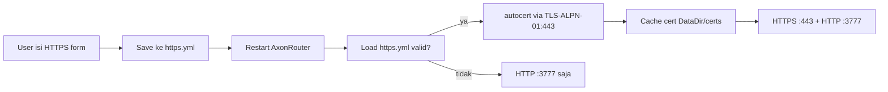

# Settings HTTPS/TLS + Settings Page Redesign

## Discovery

### Original Request
> "tambahkan fitur untuk mengaktifkan port 443 ... data cert ssl nya kita bisa buat file yml aja di simpan di direktori axon dir juga."
> "http://100.124.246.98:3777/settings di halaman itu aja, jadi buat sistem tab kayak proxy pool. sekalian redesain ui change password dan refactor UX runtime setting karena jelek."
> "saat isi domain dan email harus ada informasi kita harus set A record ke ip mana, ambil aja dari respon https://ipv4.icanhazip.com/"

### Interview Summary
- HTTP port (`AXON_PORT`, default 3777) tetap aktif bersamaan dengan HTTPS di 443; tidak redirect HTTP→HTTPS.
- HTTPS/TLS otomatis lewat Let's Encrypt (`golang.org/x/crypto/acme/autocert`).
- Konfigurasi HTTPS disimpan di `DataDir/https.yml`, dibaca saat startup.
- Jika port 443 sudah dipakai, sistem log warning dan skip; HTTP tetap jalan.
- Halaman Settings dirancang ulang dengan 3 tab: Security, HTTPS, Runtime.
- IP publik diambil backend dari `https://ipv4.icanhazip.com/` dengan fallback `https://ifconfig.me/ip`.
- Tidak perlu upload cert manual.

### Research Findings
- `internal/config/config.go:47` — `AXON_PORT` default 3777; `DataDir` default `~/.axonrouter`.
- `cmd/server/main.go:128` — single HTTP listener menggunakan `r.Run(addr)`.
- `internal/api/router.go:431` — `Run()` memanggil `gin.Engine.Run`; engine bisa dipakai untuk 2 `http.Server`.
- `internal/api/router.go:436` — `Shutdown()` hanya menghentikan background goroutine.
- `web/src/pages/ProxyPools.svelte:628` — pola tabs pakai `$lib/components/ui/tabs`.
- `go.mod:11` — `golang.org/x/crypto` mengandung `acme/autocert`.
- `go.mod:13` — `gopkg.in/yaml.v3` tersedia.

---

## Non-Goals
- Tidak redirect HTTP→HTTPS.
- Tidak mendukung upload cert manual.
- Tidak mendukung wildcard / DNS-01 challenge.
- Tidak mengubah `AXON_PORT`.
- Tidak memvalidasi propagated DNS global (hanya local lookup).

---

## Design Summary
Buat file `https.yml` di `DataDir` yang menentukan domain, email, enabled, accept_tos, staging, dan cert_cache. Saat startup `cmd/server/main.go` membaca file tersebut. Jika valid, ia membuat `autocert.Manager`, mencoba membuka listener di `:443`, dan menjalankan HTTPS server secara paralel dengan HTTP server di `AXON_PORT`. Cert disimpan otomatis di `DataDir/certs` dan di-renew oleh autocert.

Halaman Settings dibagi menjadi 3 tab:
- **Security** — Change password card (didesain ulang).
- **HTTPS** — Card dengan IP publik, instruksi A-record, form domain/email/ToS/staging, DNS check, dan status.
- **Runtime** — Daftar runtime settings yang ada dengan UX inline-edit per kartu.

---

## Tasks

### 1. Add HTTPS config model and YAML loader
**Depends on**: none
**Files:**
- Create: `internal/config/https.go`
- Test: `internal/config/https_test.go`

**What to do:**
- Define `HTTPSConfig` struct with fields: Enabled, Domain, Email, AcceptTOS, Staging, CertCache.
- Add `IsValid()` method that returns (bool, message).
- Add `LoadHTTPSConfig(dataDir)` and `SaveHTTPSConfig(dataDir, cfg)` using `gopkg.in/yaml.v3`.
- Default CertCache is `certs`.

**Must NOT do:**
- Do not store certificate private key in the YAML file; autocert handles cache files.

**Verify:**
- `go test ./internal/config -run HTTPS -v` → PASS

---

### 2. Add public IP detection helper
**Depends on**: none
**Files:**
- Create: `internal/network/publicip.go`

**What to do:**
- Implement `PublicIP(client *http.Client) (string, error)`.
- Read `AXON_PUBLIC_IP` env var first to skip external call.
- Fetch from `https://ipv4.icanhazip.com/` with fallback to `https://ifconfig.me/ip`.
- Use a 10-second timeout and read at most 64 bytes.

**Must NOT do:**
- Do not expose this result on an unauthenticated endpoint.

**Verify:**
- `go build ./internal/network` → OK

---

### 3. Add admin TLS config API
**Depends on**: 1, 2
**Files:**
- Create: `internal/api/handlers/admin/tls.go`
- Modify: `internal/api/router.go` (inside `registerAdminRoutes`)

**What to do:**
- Create `TLSHandler` with `Get`, `Put`, `PublicIP`, and `CheckDNS` methods.
- `PUT /api/admin/tls-config` validates domain/email/TOS and saves YAML.
- `GET /api/admin/tls-config` returns current config + valid flag + cert dir.
- `GET /api/admin/tls-config/public-ip` returns public IP.
- `GET /api/admin/tls-config/check-dns?domain=` resolves domain and compares to public IP.
- Register these routes inside `registerAdminRoutes`.

**Verify:**
- `go test ./internal/api -run TestTLS -v` → PASS

---

### 4. Refactor Router to support dual HTTP/HTTPS listeners
**Depends on**: 1
**Files:**
- Modify: `internal/api/router.go`
- Modify: `cmd/server/main.go`

**What to do:**
- In `Router` struct, store `httpServer`, `httpsServer`, and `tlsManager`.
- Add `Start(addr string, cfg config.HTTPSConfig) error` method that:
  - Starts HTTP server in a goroutine using the Gin engine.
  - If enabled/valid and port 443 can be bound, creates an `autocert.Manager` with `HostWhitelist(cfg.Domain)` and starts HTTPS on `:443`.
  - If port 443 is in use, logs a warning and continues with HTTP only.
- Update `Shutdown()` to shut down both servers with 5-second timeout.
- Update `cmd/server/main.go` to load HTTPS config and call `router.Start(...)` instead of `router.Run(...)`.
- Update startup banner to mention HTTPS when active.

**Verify:**
- `go build ./...` → OK
- `go test ./internal/api -v` → PASS

---

### 5. Add frontend TLS API wrapper
**Depends on**: 3
**Files:**
- Modify: `web/src/lib/api.ts`

**What to do:**
- Add `tlsApi` object with methods:
  - `get()` → returns TLS config object.
  - `save(payload)` → PUT to `/api/admin/tls-config`.
  - `publicIp()` → returns `{ ip: string }`.
  - `checkDns(domain)` → returns `{ domain, resolved_ips, public_ip, ok }`.

**Verify:**
- `cd web && npx tsc --noEmit` → no errors (assuming the command exists).

---

### 6. Redesign Settings.svelte with tabs
**Depends on**: 5
**Files:**
- Modify: `web/src/pages/Settings.svelte`
- Modify: `web/src/lib/components/ChangePasswordCard.svelte`

**What to do:**
- Wrap page with `Tabs.Root` default value `security`.
- Tabs: `Security`, `HTTPS`, `Runtime`.
- **Security tab:** render redesigned `ChangePasswordCard` (better spacing, icon, helper text) and keep import/export settings card.
- **Runtime tab:** refactor current settings list into category cards; each row shows label, description, current value, and inline Edit/Save controls with fewer nested dividers.
- **HTTPS tab:** create new section with IP display, DNS instructions, form, and save action.
- Remove the old monolithic layout.

**Verify:**
- `cd web && npm run build` → zero warnings.

---

### 7. Build HTTPS settings tab UI
**Depends on**: 6
**Files:**
- Modify: `web/src/pages/Settings.svelte`

**What to do:**
- On mount, fetch `tlsApi.get()` and `tlsApi.publicIp()`.
- Display public IP in a copyable callout: "Point A record for api.example.com to {ip}".
- Form fields: Domain, Email, Enable HTTPS toggle, Accept Let's Encrypt ToS toggle, Staging toggle.
- Button "Check DNS" calls `tlsApi.checkDns(domain)` and shows resolved IPs + match status.
- Save action validates domain/email and calls `tlsApi.save`, then shows toast success.
- If config is enabled, show a warning banner: "Restart AxonRouter to activate HTTPS on port 443".

**Verify:**
- `cd web && npm run build` → zero warnings.

---

### 8. Final integration and smoke test
**Depends on**: 4, 7
**Files:**
- Modify: `CHANGELOG.md`
- Modify: `AGENTS.md` if needed (optional)

**What to do:**
- Add CHANGELOG entry under `## [Unreleased]` for Added/Changed.
- Run backend build and tests.
- Run frontend build.
- Smoke test with `make run-dev` and verify:
  - Settings page loads with tabs.
  - HTTPS tab shows public IP and saves YAML.
  - `https.yml` written to `/tmp/axon-dev`.
  - Restarting dev server with enabled config attempts HTTPS on 443 (will fail without domain/port, should log gracefully).

**Verify:**
- `go build ./...` → OK
- `go test ./...` → PASS
- `cd web && npm run build` → zero warnings

