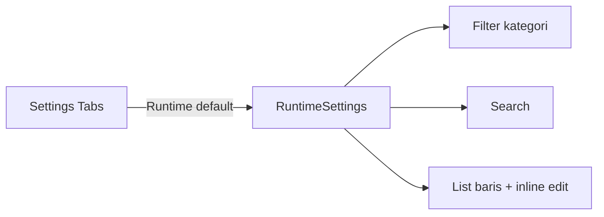

# Total Redesign of Runtime Settings UI

## Discovery

### Interview Summary
> User ingin runtime settings didesain ulang total, tidak boleh mirip layout sekarang, dan harus jadi tab pertama di halaman Settings.
> User juga kesal karena tab Runtime sekarang menampilkan setting dari sistem lain (CLI Tools, API Key, dll) di kategori "Other" — padahal hal-hal itu punya halaman sendiri.

### Clarifying Q&A
- **Q: Layout runtime mau seperti apa?**  
  A: Apapun, yang penting input langsung muncul (inline edit). Diserahkan ke desainer asal berbeda dari kartu-kategori sekarang.
- **Q: Edit nilai setting bagaimana?**  
  A: Inline langsung.
- **Q: Setting non-runtime (CLI Tools, API Key, dll) di tab Runtime?**  
  A: Tidak boleh muncul di Runtime. Runtime cuma untuk parameter runtime (interval, timeout, retention, dsb).

### Research Findings
- `web/src/pages/Settings.svelte:24` mendefinisikan `settingMeta` untuk 6 known runtime keys: `quota_check_interval`, `usage_flush_interval`, `circuit_breaker_cleanup`, `default_combo_timeout`, `max_retries`, `log_retention_days`.
- Tab Runtime sekarang menampilkan semua key dari `settingsApi.list()` termasuk unknown keys di kategori `Other`, sehingga CLI Tools config (`Clitools:Config:*`) dan Admin API Key muncul di sana.
- Tabs component sudah tersedia di `$lib/components/ui/tabs`.
- Table/list component tersedia; akan dibuat dengan div list agar styling lebih fleksibel dan responsif.

---

## Non-Goals
- Tidak memindahkan data management (export/import) dari tab Security.
- Tidak mengubah API endpoints `/api/admin/settings`.
- Tidak mengubah Change Password card atau HTTPS tab.
- Tidak membuat fitur bulk edit / edit drawer / modal.
- Tidak menampilkan unknown/non-runtime keys di tab Runtime.

---

## Design Summary
Buat komponen baru `RuntimeSettings.svelte` yang mengambil alih seluruh UI runtime. Layoutnya list/table bersih dengan header kolom yang jelas (Setting, Deskripsi, Value, Aksi). Setiap baris menampilkan nilai current sebagai monospace label; saat diklik atau tombol edit ditekan, cell value langsung berubah menjadi input InlineSave dengan icon check (save) dan X (cancel). Ada filter kategori cepat di atas (All, Background Jobs, Routing, Logging) dan search global.

Di `Settings.svelte`, tab Runtime dipindahkan jadi tab pertama dan default value-nya. State runtime (settings list, loading, error, editing) dipindahkan sepenuhnya ke komponen baru sehingga `Settings.svelte` hanya berisi shell tabs.

---

## Tasks

### 1. Create RuntimeSettings component
**Depends on**: none  
**Files:**
- Create: `web/src/lib/components/RuntimeSettings.svelte`

**What to do:**
- Fetch settings via `settingsApi.list()` on mount.
- Only show keys defined in `settingMeta` (Background Jobs, Routing, Logging). Drop `Other`.
- Add category filter pills (`All`, `Background Jobs`, `Routing`, `Logging`).
- Add search input.
- Render as a clean list/table (`div` based): columns Setting, Description, Current value, Actions.
- Inline edit: clicking the value or the Edit button swaps the value cell into an Input + Save/Cancel icon buttons.
- Save calls `settingsApi.update`, updates local state, shows toast.

**Must NOT do:**
- Do not display unknown or non-runtime keys.
- Do not use the old category-card layout.

**Verify:**
- `cd web && npm run build` → zero warnings.

---

### 2. Reorder Settings tabs and integrate RuntimeSettings
**Depends on**: 1  
**Files:**
- Modify: `web/src/pages/Settings.svelte`

**What to do:**
- Change tab order to `Runtime`, `Security`, `_https_`.
- Set default tab value to `runtime`.
- Remove runtime state, helper functions, and UI loop from `Settings.svelte`.
- Import and render `<RuntimeSettings />` inside `Tabs.Content value="runtime"`.
- Keep Change Password and Data Management in Security, and `<HttpsSettings />` in HTTPS.

**Must NOT do:**
- Do not alter ChangePasswordCard or HttpsSettings behavior.

**Verify:**
- `cd web && npm run build` → zero warnings.

---

### 3. Update CHANGELOG and smoke test
**Depends on**: 2  
**Files:**
- Modify: `CHANGELOG.md`

**What to do:**
- Add entry under `## [Unreleased] / Changed` for the runtime settings redesign.
- Run `make build-dev` and `make run-dev`, open Settings page, verify Runtime tab loads first and settings can be inline-edited.

**Verify:**
- `go test ./...` → PASS
- `cd web && npm run build` → zero warnings
- Smoke test dev server on port 3788 succeeds.
