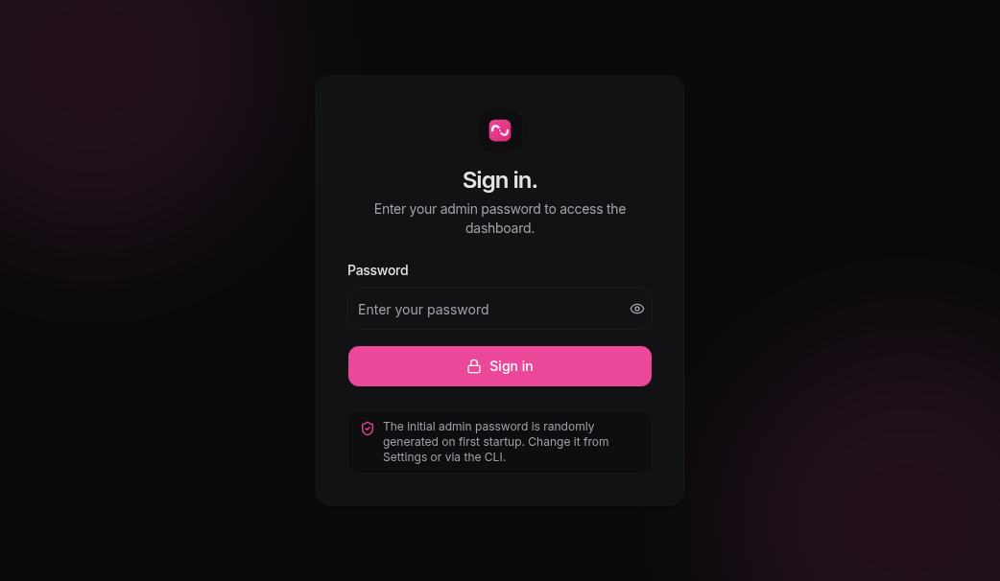
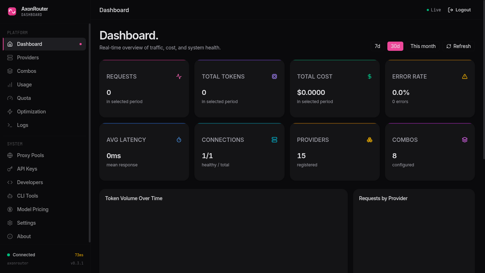

# AxonRouter-Go

<p align="center">
  <a href="https://github.com/rickicode/AxonRouter-Go/releases/latest">
    
  </a>
  <a href="https://github.com/rickicode/AxonRouter-Go/actions/workflows/release.yml">
    
  </a>
  
  
  
</p>

<p align="center">
  <strong>Universal API proxy for coding agents.</strong><br>
  One Go binary · embedded Svelte dashboard · SQLite · OpenAI / Claude / Gemini / Codex / Antigravity / Kiro
</p>

<p align="center">
  
  
</p>

---

## 🤔 Why AxonRouter-Go?

**Coding agents are amazing — until you try to feed them more than one provider.**

❌ Switching between Claude Code, Codex CLI, Cursor, Cline, and OpenCode means learning five different API formats.

❌ Each provider has its own key, base URL, rate limit, and failure mode.

❌ A single 429 or quota error kills your whole flow.

❌ You have no dashboard to see which connection is healthy right now.

AxonRouter-Go fixes all of that:

✅ **One endpoint** — every tool talks to `http://localhost:3777/v1`.

✅ **18 translation pairs** — hub-and-spoke via OpenAI plus direct translators for known pairs.

✅ **Smart combos** — fall back automatically when a provider is rate-limited, exhausted, or down.

✅ **Circuit breaker** — a failing connection is removed from rotation until it recovers.

✅ **O(1) routing** — pre-computed eligibility snapshot keeps routing under 1 ms regardless of connection count.

✅ **Built-in dashboard** — manage providers, keys, combos, logs, and proxy pools from a browser.

**Never stop coding.**

---

## 🔄 How It Works

```
Your CLI Tool (Claude Code / Codex / Cursor / Cline / OpenCode ...)
│
▼
http://localhost:3777/v1
│
▼
┌──────────────────────────────────────┐
│         AxonRouter-Go                │
│  • Format translation                │
│  • Combo routing + circuit breaker   │
│  • Per-key rate limiting             │
│  • Quota & usage tracking            │
└──────────────────┬───────────────────┘
                   │
   ├─ Subscription ── claude/claude-opus-4.7
   ├─ Cheap backup ── gemini/gemini-2.5-pro
   └─ Free fallback ── oc/qwen-coder-plus
```

1. Your coding agent sends an OpenAI-compatible request.
2. AxonRouter parses the model name (`openai/gpt-4o`, `claude/claude-sonnet-4`, `smart/balanced`, ...).
3. If the model is a **combo**, it walks the priority list until a healthy connection answers.
4. The request is translated to the provider's native format and executed upstream.
5. The response is translated back and returned to your agent.
6. Usage, tokens, and latency are logged to SQLite for the dashboard.

---

## ⚡ Quick Start

### One-line install (recommended)

```bash
curl -fsSL https://raw.githubusercontent.com/rickicode/AxonRouter-Go/master/installer.sh | bash
```

The installer detects your OS/arch and installs `axonrouter` into the first writable directory it finds:

1. `~/.local/bin`
2. `/usr/local/bin`

Then run it:

```bash
axonrouter
```

Open http://localhost:3777, log in, add your first connection, and start routing.

### Build from source

```bash
# Clone
git clone https://github.com/rickicode/AxonRouter-Go.git
cd AxonRouter-Go

# Install frontend dependencies
cd web && npm install && cd ..

# Build everything
make build

# Run
./build/axonrouter
```

Server starts on port **3777** by default. Dashboard: **http://localhost:3777**.

---

## 🛠️ Supported CLI Tools

| Tool | Notes |
|------|-------|
| **Claude Code** | Set `--api-base-url http://localhost:3777` |
| **Codex CLI** | Set `OPENAI_BASE_URL=http://localhost:3777/v1` |
| **Cursor** | Add custom OpenAI-compatible provider |
| **Cline** | OpenAI-compatible mode |
| **Continue** | OpenAI-compatible provider config |
| **Roo Code** | Same model override as Cline |
| **OpenClaw** | OpenAI-compatible endpoint |
| **Kiro** | OAuth-managed connection in dashboard |
| **OpenCode** | Free and paid OpenCode prefix support |

> **Any OpenAI-compatible client works.** Point it at `http://localhost:3777/v1` and use provider-prefixed model names.

See [docs/INTEGRATIONS.md](docs/INTEGRATIONS.md) for per-tool copy-paste settings.

---

## 🌐 Supported Providers

| Provider | Prefix | Format | Auth |
|----------|--------|--------|------|
| OpenAI | `openai/` | openai | API key |
| Claude | `claude/` | anthropic | API key / OAuth PKCE |
| Gemini | `gemini/` | gemini | API key |
| Codex | `cx/` | openai-responses | OAuth device code |
| Antigravity | `ag/` | antigravity | OAuth Google |
| Kiro | `kiro/` | kiro (openai-compatible) | OAuth AWS |
| Z.ai | `zai/` | claude | API key |
| DeepSeek | `deepseek/` | openai | API key |
| Groq | `groq/` | openai | API key |
| MiMoCode | `mimocode/` | openai | none (free) |
| MiMoCode Free | `mimocode-free/` | openai | none (free) |
| MiMo Token Plan | `mimo-tp/` | openai | API key |
| OpenRouter | `openrouter/` | openai | API key |
| OpenCode Free | `oc/` | openai | none (free) |
| OpenCode Zen | `oc-zen/` | openai | API key |
| OpenCode Go | `oc-go/` | openai | API key |
| Cloudflare Workers AI | `cf/` | openai | API key |
| ElevenLabs | `elevenlabs/` | openai | API key |
| Deepgram | `deepgram/` | openai | API key |
| Custom OpenAI | `<your-name>/` | openai | API key |
| Custom Claude | `<your-name>/` | claude | API key |

Setup details for each provider are in [docs/INTEGRATIONS.md](docs/INTEGRATIONS.md).

---

## 💡 Key Features

| Feature | What It Does | Why It Matters |
|---------|--------------|----------------|
| **Universal Proxy** | One endpoint handles OpenAI, Claude, Gemini, Codex, Antigravity, Kiro, and more. | Stop reconfiguring every tool. |
| **18 Translation Pairs** | Hub-and-spoke + direct translators for known format pairs. | Use Claude clients with OpenAI keys and vice versa. |
| **Combo Routing + Circuit Breaker** | Tries a priority list; gates broken connections with `CLOSED → OPEN → HALF_OPEN`. | 429s, quota errors, and outages don't kill your session. |
| **O(1) Routing** | Pre-computed eligibility snapshot with 50 ms coalesce. | Routing stays under 1 ms at 1,000+ connections. |
| **OAuth Auto-Refresh** | Proactive token rotation for Codex, Antigravity, and Kiro. | No manual re-auth in the middle of a long task. |
| **Per-Key Rate Limiting** | Token bucket per API key or per-IP fallback. | Protect shared setups and public dashboards. |
| **Error Classification** | Auto-detects rate limit, quota exhausted, balance empty, auth failed. | Recovery happens automatically. |
| **Embedded Dashboard** | Svelte 5 SPA served by the Go binary via `go:embed`. | Manage everything from the browser. |
| **Single Binary** | SQLite + frontend + backend in one file. | Drop it on a server and run. |

---

## 💰 Cost Tiers

AxonRouter itself is free (MIT). The table below shows how you can route across real provider price classes inside one combo.

| Tier | Example Providers | Typical Use | Combo Example |
|------|-------------------|-------------|---------------|
| **Subscription** | `openai/`, `claude/`, `cx/` | Daily driver with the best reasoning. | `premium` → use this first. |
| **Cheap** | `deepseek/`, `groq/`, `gemini/` | Fast, capable, cost-sensitive. | `balanced` → subscription first, cheap backup. |
| **Free** | `mimocode-free/`, `oc/`, `cf/` | Prototyping and burn-rate-zero work. | `economy` → free first, paid only if needed. |

Build a combo that fits your budget:

```bash
# Use a balanced combo that falls back across tiers
curl http://localhost:3777/v1/chat/completions \
  -H "Authorization: Bearer YOUR_AXON_KEY" \
  -d '{"model":"smart/balanced","messages":[{"role":"user","content":"hi"}]}'
```

---

## 🎯 Use Cases

### 1. Maximize an existing subscription

You already pay for Claude Pro, OpenAI, and Codex. Route them into one combo so your agent always starts with the best available subscription.

```json
{
  "name": "premium",
  "strategy": "priority",
  "steps": [
    {"model_id": "claude/claude-opus-4.7", "priority": 1},
    {"model_id": "cx/gpt-5.4", "priority": 2},
    {"model_id": "openai/gpt-4o", "priority": 3}
  ]
}
```

### 2. Zero-cost coding stack

For side projects or burn-rate-zero experiments, prefer free providers and only fall back to paid providers when the free tier is exhausted.

```json
{
  "name": "zero-cost",
  "strategy": "priority",
  "steps": [
    {"model_id": "oc/qwen-coder-plus", "priority": 1},
    {"model_id": "mimocode-free/mimo-v2-pro", "priority": 2},
    {"model_id": "deepseek/deepseek-chat", "priority": 3}
  ]
}
```

### 3. 24/7 no-interruption fallback

Combine subscription, cheap, and free tiers into a single combo. If one provider hits a rate limit or quota wall, AxonRouter silently fails over to the next.

```json
{
  "name": "always-on",
  "strategy": "priority",
  "steps": [
    {"model_id": "claude/claude-sonnet-4", "priority": 1},
    {"model_id": "gemini/gemini-2.5-pro", "priority": 2},
    {"model_id": "groq/llama-3.3-70b-versatile", "priority": 3},
    {"model_id": "oc/qwen-coder-plus", "priority": 4}
  ]
}
```

---

## ❓ FAQ

### Is it free?

Yes. AxonRouter-Go is MIT licensed. You bring your own provider keys and pay those providers directly; AxonRouter itself does not charge anything.

### Is it safe to store API keys?

API keys are **bcrypt hashed** in the database. Admin access uses a **JWT session** seeded on first boot; change the default password with `axonrouter --setpass <password>`. The dashboard warns you until the default password is changed.

### How do rate limits work?

You can set a per-key token bucket limit in the dashboard. If no key limit is configured, AxonRouter falls back to a per-IP limit. Upstream rate-limit headers are parsed and respected when available.

### Which free providers work?

MiMoCode Free (`mimocode-free/`), OpenCode Free (`oc/`), and Cloudflare Workers AI (`cf/`) are all supported. Free providers can change rate limits or availability, so combos are strongly recommended.

### Why Go instead of Node?

A single Go binary embeds the SQLite database, the Svelte frontend, and the HTTP server. It starts in under a second, routes in sub-millisecond time, and ships as one file with no runtime dependencies beyond the binary itself.

### Which model should I pick?

Start with a built-in combo (`smart/balanced`, `smart/premium`, etc.) or create your own. If you know exactly what you want, use a provider-prefixed model name like `claude/claude-sonnet-4` or `deepseek/deepseek-chat`.

---

## 📖 Setup Guide

For tool-by-tool copy-paste settings, see [docs/INTEGRATIONS.md](docs/INTEGRATIONS.md).

For full deployment instructions — environment variables, systemd, Docker, upgrading, and performance tuning — see [docs/DEPLOYMENT.md](docs/DEPLOYMENT.md).

Quick links:

[Integrations](docs/INTEGRATIONS.md)
[Deployment Guide](docs/DEPLOYMENT.md)
[API Reference](docs/API.md)
[Architecture](docs/ARCHITECTURE.md)
[Changelog](CHANGELOG.md)

---

## 🔌 API Reference

Proxy endpoints:

- `POST /v1/chat/completions`
- `POST /v1/messages`
- `POST /v1/responses`
- `GET /v1/models`
- `POST /v1/audio/speech`
- `POST /v1/audio/transcriptions`
- `POST /v1/images/generations`
- `POST /v1/video/generations`
- `POST /v1/embeddings`
- `POST /v1/unified`

Admin endpoints live under `/api/admin/*` and cover providers, connections, combos, logs, settings, quota, proxy pools, and model pricing.

Full details are in [docs/API.md](docs/API.md).

---

## 🏗️ Architecture

AxonRouter-Go is a single Go binary. A Gin router serves the embedded Svelte dashboard and handles `/v1/*` proxy routes plus `/api/admin/*` admin routes. Internally, a translator hub converts requests between formats, a combo resolver selects the right connection, and an eligibility snapshot grants O(1) routing.

```
┌───────────────────────────────────────────┐
│          AxonRouter-Go Binary             │
│  ┌──────────────┐    ┌──────────────────┐  │
│  │  /v1/* proxy │    │ /api/admin/*     │  │
│  │  translator  │    │ dashboard API    │  │
│  │  executor    │    │ providers, logs  │  │
│  │  combo       │    │ combos, settings │  │
│  └──────────────┘    └──────────────────┘  │
│  ┌─────────────────────────────────────┐  │
│  │  SQLite + background jobs + cache   │  │
│  └─────────────────────────────────────┘  │
└───────────────────────────────────────────┘
```

See [docs/ARCHITECTURE.md](docs/ARCHITECTURE.md) for the full package structure and request flow.

---

## 📦 Deployment & Development

Common Makefile targets:

```bash
make build      # full production binary
make frontend   # build dashboard only
make backend    # build Go binary only
make dev        # frontend hot reload (port 5173)
make run-dev    # dev server on port 3788 with isolated data dir
make test       # run tests
make lint       # run linter
make clean      # remove build artifacts
```

See [docs/DEPLOYMENT.md](docs/DEPLOYMENT.md) for systemd, Docker, environment variables, and tuning.

---

## 🛠️ Tech Stack

| Layer | Technology |
|-------|------------|
| **Backend** | Go 1.23 + Gin + SQLite (WAL mode) |
| **Frontend** | Svelte 5 + Vite + Tailwind CSS v4 + shadcn-svelte |
| **Database** | SQLite (embedded, zero config) |
| **Build** | Static frontend embedded via `go:embed` |

---

## 🚀 Latest Release Notes

<!-- LATEST_CHANGELOG_START -->
### What's New in v0.3.3

### Added
- Native HTTPS on port 443 via Let's Encrypt (`golang.org/x/crypto/acme/autocert`) configured from the dashboard Settings → HTTPS tab.
- Admin TLS API endpoints (`/api/admin/tls-config`, `/api/admin/tls-config/public-ip`, `/api/admin/tls-config/check-dns`) for HTTPS setup.
- `internal/config/https.go` persists HTTPS config to `https.yml` and router starts dual HTTP/HTTPS listeners.
- Public IP detection helper `internal/network/publicip.go` with `AXON_PUBLIC_IP` override and fallback lookup.
- `category` and `service_kinds` columns on `provider_types`, exposed in admin provider List/Get responses.
- `internal/provider/servicekind.go` constants (`llm`, `embedding`, `image`, etc.) and helpers `HasServiceKind`/`DefaultServiceKinds`.
- Static per-modality registry (`internal/modalities`) using embedded JSON, with a Cloudflare pilot covering canonical embedding and image model IDs.
- `service_kinds` field on model catalog entries, included in `/v1/models`, admin models, admin provider model list, and admin model-pricing responses.
- Cloudflare Workers AI routing for `/v1/embeddings` and `/v1/images/generations` through executor adapters and per-modality model gating.
- Dashboard provider category/service-kind chips and modality badges in the model picker, model pricing, and provider detail pages (LLM-only badges hidden).
- `must_change_password` flag returned by `/api/admin/health`; the dashboard warning is driven entirely by this endpoint.
- Dedicated change-password card on the Settings page with current/new/confirm password fields.
- Copy icon on each model card in the provider detail page to copy the full model name.
- `copyToClipboard` utility with `execCommand` fallback so copy buttons work on plain HTTP deployments.
- `tokens_estimated` column to request logs via database migration, with DB model field and zero-default.
- Fallback token estimator (`internal/usage/fallback.go`) using content-length heuristics for requests and responses.
- `tokens_estimated` badge in dashboard `Logs.svelte` and `tokens_estimated` field in admin API (`RequestLog` interface).
- Per-chunk token extraction from streaming SSE chunks and `MergeTokenCounts` aggregator in `internal/api/handlers/v1/stream.go`.
- `stream_options.include_usage` injection for OpenAI-compatible streaming requests and automatic stripping in all other cases.
- Per-chunk token accumulation in streaming response handler via `StreamTokenCounts` replacing final-chunk-only extraction.
- Fallback token estimation applied in request handlers (chat, messages, responses) when API usage is absent.
- Password-change warning driven by `/api/admin/health` only; admin endpoints are no longer blocked when the default password has not been changed.
- `make test` and `make lint` Makefile targets.
- Multi-stage `Dockerfile` and `.dockerignore`.
- GitHub Actions CI workflow (`ci.yml`) running lint, tests, and frontend build.
- Frontend unit-test harness with Vitest and smoke tests for auth/password API.
- Auto-add missing proxy pool connections UI in OpenCode Free AddConnectionModal.
- Searchable, scrollable proxy pool selector in OpenCode Free AddConnectionModal.
- Settings page now groups runtime settings by category and supports live search.
- Proxy pool bulk select with row checkboxes, bulk test/delete toolbar, and "Delete all error/timeout" confirmation.
- Unified "Add pool" dialog with Single/Bulk tabs; bulk import supports healthy-only filtering and optional <1s response-time filtering.
- `POST /proxy-pools/bulk-delete` endpoint supporting deletion by `ids` or `test_status`.
- Cached GitHub latest-release checker in `internal/version/upgrade.go` with a 5-minute in-memory cache and zero-dependency semver comparison.
- `GET /api/admin/health` now returns `latest_version` and `update_available` via the version checker.
- `POST /api/admin/upgrade` endpoint downloads the platform-specific release binary, verifies its SHA256 against `checksums.txt`, and writes it to `<DataDir>/bin/<asset>`.
- About page (`/about`) with project summary, repository link, version card, changelog section, and System sidebar entry.
- `web/src/lib/about-utils.ts` utilities for version normalization, semver comparison, and changelog parsing, with Vitest coverage.
- Release workflow now generates and attaches `build/checksums.txt` with SHA256 sums for all binary artifacts.
- About page polls `/api/admin/health` every 30s for update availability and posts to `/api/admin/upgrade` with toast feedback and a loading spinner.
- `random` mode for proxy groups; resolver selects a uniform random active pool per request.
- Bulk pool selector in the Proxy Pools → Groups create/edit modal: large scrollable table, select-all/clear, test selected/test all, select lowest latency, and select healthy.
- `proxyPoolsApi.listAll()` frontend helper that fetches all proxy pools across paginated pages.
- `proxy_pool_id` column on `request_logs` with migration; every v1 request handler records the resolved proxy pool ID.
- Request-log queries join `proxy_pools` and return `proxy_pool_name` so the dashboard can show direct vs proxy routing.
- Logs page latency column now shows `direct` or the proxy pool name for each request.

### Fixed
- `/v1/embeddings` and `/v1/images/generations` now validate the provider's service kind and, for Cloudflare, require a registered per-modality model before routing.
- Migration ensures the built-in `openai` provider type keeps `embedding` and `image` service kinds so existing OpenAI embeddings and DALL-E routing continue to work.
- Provider detail header: provider name and prefix now sit next to the logo on the left instead of being pushed to the right.
- Responses API `input_tokens`/`output_tokens` no longer zeroed out by the old `TotalTokens` check in `ExtractTokensFromBody`.
- `go test ./...` failure caused by stale `NewProviderHandler` call in `providers_test.go`.
- Context/timer leak in `internal/executor/base.go` reported by `go vet`.
- Untuned HTTP transport (default `MaxIdleConnsPerHost=2`) replaced with pool tuned for high concurrency.
- Bounded routing selection so the hot path samples a constant number of candidates before falling back to a full scan.
- Missing `database.Close()` on graceful shutdown.
- Flaky `TestParseFiltersUsesMilliseconds` assertion that depended on time-of-day.
- `/v1/*` auth is now fail-closed: missing/invalid API keys always return 401 instead of slipping through.
- Request bodies larger than 10 MB are rejected with 413 before reaching downstream handlers; the original body is preserved for the normal path.
- Exact response cache now only stores upstream responses with 2xx status codes; errors are no longer cached.
- Non-chat handlers (`/v1/images/generations`, `/v1/video/generations`, `/v1/audio/*`, `/v1/embeddings`) now pass through the real upstream HTTP status and body instead of masking them as 502.
- `/v1/responses` now mirrors `/v1/chat/completions` and passes through non-retryable upstream client errors (e.g., 400 context length) instead of failing over to a generic 503.
- `/v1/embeddings` and `/v1/responses` routes are now mounted and reachable.
- Small error-handling paths hardened: read-body errors return consistent 413 payloads, context cancellations return explicit 499/504, and malformed `provider_specific_data` no longer crashes handlers.
- Removed dead `handleNonStreamResponse` code from `internal/api/handlers/v1/chat.go`.
- Token-bucket refill math fixed for per-minute limits under 60 requests/min, avoiding zero-refill rounding errors.
- Dashboard login is now rate-limited per IP to slow brute-force attempts.
- `ReplaceImageUrls` in `internal/compression/lite.go` now correctly replaces inline data-image URLs and preserves real OpenAI vision `image_url` parts; regex compile errors fail open.
- Version scripts `bump-version.js` and `sync-release-from-tag.js` tolerate existing release sections and always synchronize `README.md`.

### Changed
- Settings page redesigned into Runtime, Security, and HTTPS tabs with Runtime as the default tab.
- Default data directory moved from `~/.axonrouter` to `~/axonrouter`; the `AXON_DATA_DIR` environment variable is no longer read or documented.
- Systemd service installed by the binary (`axonrouter --startup install`) and by `installer.sh --service` no longer sets `AXON_DATA_DIR`; it relies on the binary default relative to the service user's home directory.
- Binary CLI now supports `--help`, `--startup {install|status|start|stop|restart}` for systemd management, and `--setpass <password>`.
- Installer automatically appends the install directory to `~/.bashrc`/`~/.zshrc` when it is not already on `PATH`.
- Runtime settings fully redesigned as a clean list/table with category filter pills, search, and inline edit; non-runtime keys (CLI Tools, API Key, etc.) are no longer shown in the Runtime tab.
- Optimization dashboard page redesigned: tabs now use pill-style controls matching ProxyPools, and the Cache tab gained a header row with refresh/flush actions, proper stat cards for hits/misses/hit rate/entries, plus a clarification note explaining cache eligibility for non-streaming/tool/cache_control responses.
- `ExtractTokensFromBody` extended to parse Gemini `usageMetadata` and OpenAI Responses API `response.usage`/`usage` shapes.
- Usage tracker stores `tokens_estimated` flag in log entries for distinguishing estimated vs actual token counts.
- Documentation now correctly notes that the CLI entry point is planned but not yet shipped.
- Default admin password is now randomly generated on first startup and stored in `admin_password_plain`; the initial hardcoded password has been removed. A warning is shown on the dashboard until the password is changed.
<!-- LATEST_CHANGELOG_END -->

See the full [CHANGELOG.md](./CHANGELOG.md) for older releases.

---

## 📜 License

MIT License
