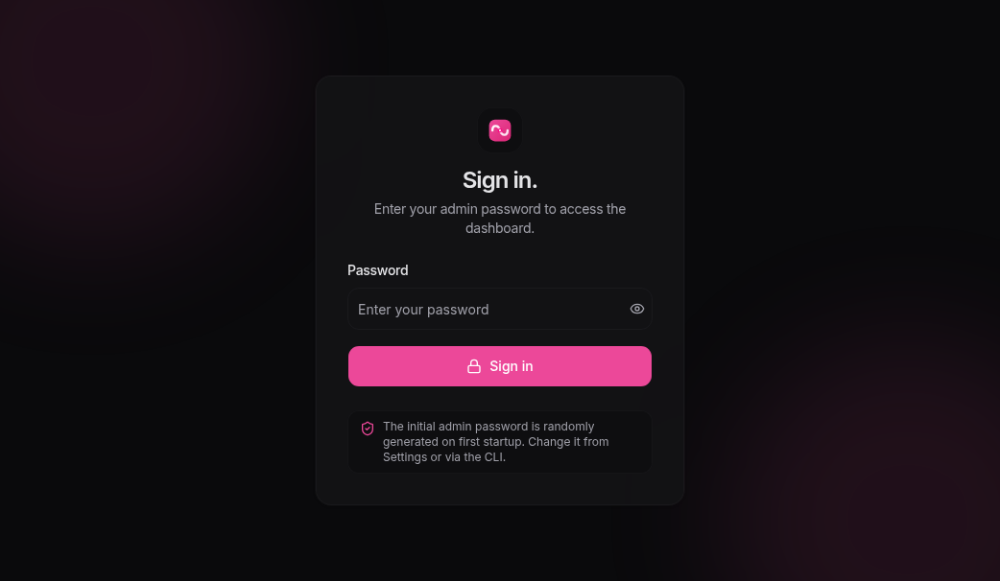
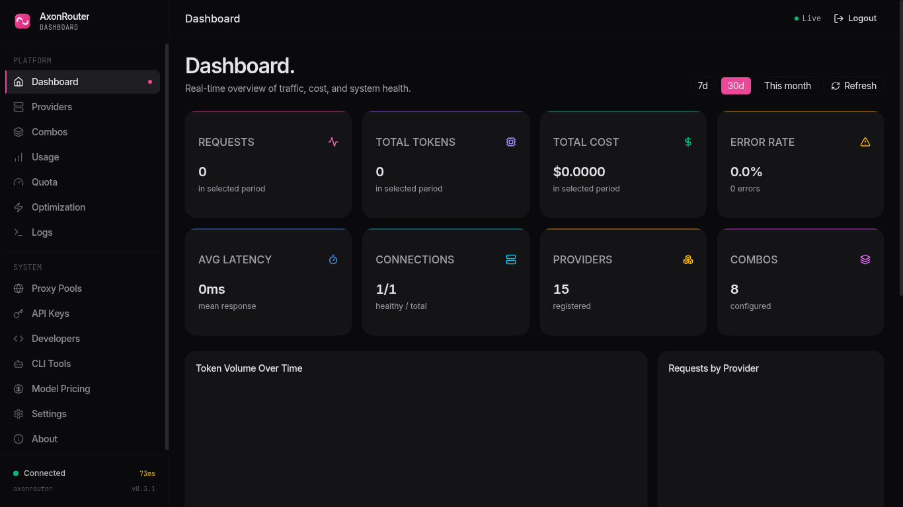

# AxonRouter-Go

<p align="center">
  <a href="https://github.com/rickicode/AxonRouter-Go/releases/latest">
    
  </a>
  <a href="https://github.com/rickicode/AxonRouter-Go/actions/workflows/release.yml">
    
  </a>
  
  
  
</p>

<p align="center">
  <strong>Universal API proxy for coding agents.</strong><br>
  One Go binary · embedded Svelte dashboard · SQLite · OpenAI / Claude / Gemini / Codex / Antigravity / Kiro
</p>

<p align="center">
  
  
</p>

---

## 🤔 Why AxonRouter-Go?

**Coding agents are amazing — until you try to feed them more than one provider.**

❌ Switching between Claude Code, Codex CLI, Cursor, Cline, and OpenCode means learning five different API formats.

❌ Each provider has its own key, base URL, rate limit, and failure mode.

❌ A single 429 or quota error kills your whole flow.

❌ You have no dashboard to see which connection is healthy right now.

AxonRouter-Go fixes all of that:

✅ **One endpoint** — every tool talks to `http://localhost:3777/v1`.

✅ **18 translation pairs** — hub-and-spoke via OpenAI plus direct translators for known pairs.

✅ **Smart combos** — fall back automatically when a provider is rate-limited, exhausted, or down.

✅ **Circuit breaker** — a failing connection is removed from rotation until it recovers.

✅ **O(1) routing** — pre-computed eligibility snapshot keeps routing under 1 ms regardless of connection count.

✅ **Built-in dashboard** — manage providers, keys, combos, logs, and proxy pools from a browser.

**Never stop coding.**

---

## 🔄 How It Works

```
Your CLI Tool (Claude Code / Codex / Cursor / Cline / OpenCode ...)
│
▼
http://localhost:3777/v1
│
▼
┌──────────────────────────────────────┐
│         AxonRouter-Go                │
│  • Format translation                │
│  • Combo routing + circuit breaker   │
│  • Per-key rate limiting             │
│  • Quota & usage tracking            │
└──────────────────┬───────────────────┘
                   │
   ├─ Subscription ── claude/claude-opus-4.7
   ├─ Cheap backup ── gemini/gemini-2.5-pro
   └─ Free fallback ── oc/qwen-coder-plus
```

1. Your coding agent sends an OpenAI-compatible request.
2. AxonRouter parses the model name (`openai/gpt-4o`, `claude/claude-sonnet-4`, `smart/balanced`, ...).
3. If the model is a **combo**, it walks the priority list until a healthy connection answers.
4. The request is translated to the provider's native format and executed upstream.
5. The response is translated back and returned to your agent.
6. Usage, tokens, and latency are logged to SQLite for the dashboard.

---

## ⚡ Quick Start

### One-line install (recommended)

```bash
curl -fsSL https://raw.githubusercontent.com/rickicode/AxonRouter-Go/master/installer.sh | bash
```

The installer detects your OS/arch and installs `axonrouter` into `~/.local/bin` by default.
Use `sudo` or `--to /usr/local/bin` for a system-wide install.

Then run it:

```bash
axonrouter
```

Open http://localhost:3777, log in, add your first connection, and start routing.

### Run once with npx (no install)

If the package is published to npm, you can download and run it once:

```bash
npx axonrouter-go --help
npx axonrouter-go
```

For repeated use or to install a systemd service, use the installer or `npm install -g axonrouter-go` instead.

### Build from source

```bash
# Clone
git clone https://github.com/rickicode/AxonRouter-Go.git
cd AxonRouter-Go

# Install frontend dependencies
cd web && npm install && cd ..

# Build everything
make build

# Run
./build/axonrouter
```

Server starts on port **3777** by default. Dashboard: **http://localhost:3777**.

---

## 🛠️ Supported CLI Tools

| Tool | Notes |
|------|-------|
| **Claude Code** | Set `--api-base-url http://localhost:3777` |
| **Codex CLI** | Set `OPENAI_BASE_URL=http://localhost:3777/v1` |
| **Cursor** | Add custom OpenAI-compatible provider |
| **Cline** | OpenAI-compatible mode |
| **Continue** | OpenAI-compatible provider config |
| **Roo Code** | Same model override as Cline |
| **OpenClaw** | OpenAI-compatible endpoint |
| **Kiro** | OAuth-managed connection in dashboard |
| **Grok Build** | Configure via dashboard CLI tools page |
| **OpenCode** | Free and paid OpenCode prefix support |
| **Cowork** | Claude Desktop 3P / enterprise inference mode |
| **PI Coding Agent** | OpenAI-compatible provider registration |
| **OMP (Oh My Pi)** | OpenAI-compatible provider registration |

> **Any OpenAI-compatible client works.** Point it at `http://localhost:3777/v1` and use provider-prefixed model names.

See [docs/INTEGRATIONS.md](docs/INTEGRATIONS.md) and the dashboard **CLI Tools** page for per-tool copy-paste settings.

---

## 🌐 Supported Providers

| Provider | Prefix | Format | Auth |
|----------|--------|--------|------|
| OpenAI | `openai/` | openai | API key |
| Claude | `claude/` | anthropic | API key / OAuth PKCE |
| Gemini | `gemini/` | gemini | API key |
| Codex | `cx/` | openai-responses | OAuth device code |
| Antigravity | `ag/` | antigravity | OAuth Google |
| Kiro | `kiro/` | kiro (openai-compatible) | OAuth AWS |
| Z.ai | `zai/` | claude | API key |
| DeepSeek | `deepseek/` | openai | API key |
| Groq | `groq/` | openai | API key |
| MiMoCode | `mimocode/` | openai | none (free) |
| MiMoCode Free | `mimocode-free/` | openai | none (free) |
| MiMo Token Plan | `mimo-tp/` | openai | API key |
| OpenRouter | `openrouter/` | openai | API key |
| OpenCode Free | `oc/` | openai | none (free) |
| OpenCode Zen | `oc-zen/` | openai | API key |
| OpenCode Go | `oc-go/` | openai | API key |
| Cloudflare Workers AI | `cf/` | openai | API key |
| ElevenLabs | `elevenlabs/` | openai | API key |
| Deepgram | `deepgram/` | openai | API key |
| Custom OpenAI | `<your-name>/` | openai | API key |
| Custom Claude | `<your-name>/` | claude | API key |
| Cursor | `cursor/` | openai | OAuth (imported from IDE) |
| ZenMux | `zenmux/` | openai | API key |
| ZenMux Free | `zenmux-free/` | openai | API key |
| Grok CLI | `grok-cli/` | grok-cli | OAuth |
| GitHub Copilot | `copilot/` | openai | OAuth |
| CodeBuddy | `codebuddy/` | openai | OAuth |
| Qoder | `qoder/` | openai | OAuth |
| Tavily | `tavily/` | openai | API key |
| Brave Search | `brave/` | openai | API key |
| Exa | `exa/` | openai | API key |
| Jina AI | `jina/` | openai | API key |
| Google PSE | `google-pse/` | openai | API key |
| Firecrawl | `firecrawl/` | openai | API key |

Setup details for each provider are in [docs/INTEGRATIONS.md](docs/INTEGRATIONS.md).

---

## 💡 Key Features

| Feature | What It Does | Why It Matters |
|---------|--------------|----------------|
| **Universal Proxy** | One endpoint handles OpenAI, Claude, Gemini, Codex, Antigravity, Kiro, and more. | Stop reconfiguring every tool. |
| **18 Translation Pairs** | Hub-and-spoke + direct translators for known format pairs. | Use Claude clients with OpenAI keys and vice versa. |
| **Combo Routing + Circuit Breaker** | Tries a priority list; gates broken connections with `CLOSED → OPEN → HALF_OPEN`. | 429s, quota errors, and outages don't kill your session. |
| **O(1) Routing** | Pre-computed eligibility snapshot with 50 ms coalesce. | Routing stays under 1 ms at 1,000+ connections. |
| **OAuth Auto-Refresh** | Proactive token rotation for Codex, Antigravity, and Kiro. | No manual re-auth in the middle of a long task. |
| **Per-Key Rate Limiting** | Token bucket per API key or per-IP fallback. | Protect shared setups and public dashboards. |
| **Error Classification** | Auto-detects rate limit, quota exhausted, balance empty, auth failed. | Recovery happens automatically. |
| **Embedded Dashboard** | Svelte 5 SPA served by the Go binary via `go:embed`. | Manage everything from the browser. |
| **Single Binary** | SQLite + frontend + backend in one file. | Drop it on a server and run. |

---

## 💰 Cost Tiers

AxonRouter itself is free (MIT). The table below shows how you can route across real provider price classes inside one combo.

| Tier | Example Providers | Typical Use | Combo Example |
|------|-------------------|-------------|---------------|
| **Subscription** | `openai/`, `claude/`, `cx/` | Daily driver with the best reasoning. | `premium` → use this first. |
| **Cheap** | `deepseek/`, `groq/`, `gemini/` | Fast, capable, cost-sensitive. | `balanced` → subscription first, cheap backup. |
| **Free** | `mimocode-free/`, `oc/`, `cf/` | Prototyping and burn-rate-zero work. | `economy` → free first, paid only if needed. |

Build a combo that fits your budget:

```bash
# Use a balanced combo that falls back across tiers
curl http://localhost:3777/v1/chat/completions \
  -H "Authorization: Bearer YOUR_AXON_KEY" \
  -d '{"model":"smart/balanced","messages":[{"role":"user","content":"hi"}]}'
```

---

## 🎯 Use Cases

### 1. Maximize an existing subscription

You already pay for Claude Pro, OpenAI, and Codex. Route them into one combo so your agent always starts with the best available subscription.

```json
{
  "name": "premium",
  "strategy": "priority",
  "steps": [
    {"model_id": "claude/claude-opus-4.7", "priority": 1},
    {"model_id": "cx/gpt-5.4", "priority": 2},
    {"model_id": "openai/gpt-4o", "priority": 3}
  ]
}
```

### 2. Zero-cost coding stack

For side projects or burn-rate-zero experiments, prefer free providers and only fall back to paid providers when the free tier is exhausted.

```json
{
  "name": "zero-cost",
  "strategy": "priority",
  "steps": [
    {"model_id": "oc/qwen-coder-plus", "priority": 1},
    {"model_id": "mimocode-free/mimo-v2-pro", "priority": 2},
    {"model_id": "deepseek/deepseek-chat", "priority": 3}
  ]
}
```

### 3. 24/7 no-interruption fallback

Combine subscription, cheap, and free tiers into a single combo. If one provider hits a rate limit or quota wall, AxonRouter silently fails over to the next.

```json
{
  "name": "always-on",
  "strategy": "priority",
  "steps": [
    {"model_id": "claude/claude-sonnet-4", "priority": 1},
    {"model_id": "gemini/gemini-2.5-pro", "priority": 2},
    {"model_id": "groq/llama-3.3-70b-versatile", "priority": 3},
    {"model_id": "oc/qwen-coder-plus", "priority": 4}
  ]
}
```

---

## ❓ FAQ

### Is it free?

Yes. AxonRouter-Go is MIT licensed. You bring your own provider keys and pay those providers directly; AxonRouter itself does not charge anything.

### Is it safe to store API keys?

API keys are **bcrypt hashed** in the database. Admin access uses a **JWT session** seeded on first boot; change the default password with `axonrouter --setpass <password>`. The dashboard warns you until the default password is changed.

### How do rate limits work?

You can set a per-key token bucket limit in the dashboard. If no key limit is configured, AxonRouter falls back to a per-IP limit. Upstream rate-limit headers are parsed and respected when available.

### Which free providers work?

MiMoCode Free (`mimocode-free/`), OpenCode Free (`oc/`), and Cloudflare Workers AI (`cf/`) are all supported. Free providers can change rate limits or availability, so combos are strongly recommended.

### Why Go instead of Node?

A single Go binary embeds the SQLite database, the Svelte frontend, and the HTTP server. It starts in under a second, routes in sub-millisecond time, and ships as one file with no runtime dependencies beyond the binary itself.

### Which model should I pick?

Start with a built-in combo (`smart/balanced`, `smart/premium`, etc.) or create your own. If you know exactly what you want, use a provider-prefixed model name like `claude/claude-sonnet-4` or `deepseek/deepseek-chat`.

---

## 📖 Setup Guide

For tool-by-tool copy-paste settings, see [docs/INTEGRATIONS.md](docs/INTEGRATIONS.md).

For full deployment instructions — environment variables, systemd, Docker, upgrading, and performance tuning — see [docs/DEPLOYMENT.md](docs/DEPLOYMENT.md).

Quick links:

[Integrations](docs/INTEGRATIONS.md)
[Deployment Guide](docs/DEPLOYMENT.md)
[API Reference](docs/API.md)
[Architecture](docs/ARCHITECTURE.md)
[Changelog](CHANGELOG.md)

---

## 🔌 API Reference

Proxy endpoints:

- `POST /v1/chat/completions`
- `POST /v1/completions`
- `POST /v1/messages`
- `POST /v1/responses`
- `POST /v1/responses/compact`
- `POST /v1/live`
- `POST /v1/realtime/calls`
- `POST /v1/videos`
- `POST /v1/videos/generations`
- `GET /v1/models`
- `POST /v1/audio/speech`
- `POST /v1/audio/transcriptions`
- `POST /v1/images/generations`
- `POST /v1/images/edits`
- `POST /v1beta/models/{model}:{generateContent,countTokens,streamGenerateContent}`
- `POST /v1/embeddings`
- `POST /v1/unified`

Admin endpoints live under `/api/admin/*` and cover providers, connections, combos, logs, settings, quota, proxy pools, and model pricing.

Full details are in [docs/API.md](docs/API.md).

---

## 🏗️ Architecture

AxonRouter-Go is a single Go binary. A Gin router serves the embedded Svelte dashboard and handles `/v1/*` proxy routes plus `/api/admin/*` admin routes. Internally, a translator hub converts requests between formats, a combo resolver selects the right connection, and an eligibility snapshot grants O(1) routing.

```
┌───────────────────────────────────────────┐
│          AxonRouter-Go Binary             │
│  ┌──────────────┐    ┌──────────────────┐  │
│  │  /v1/* proxy │    │ /api/admin/*     │  │
│  │  translator  │    │ dashboard API    │  │
│  │  executor    │    │ providers, logs  │  │
│  │  combo       │    │ combos, settings │  │
│  └──────────────┘    └──────────────────┘  │
│  ┌─────────────────────────────────────┐  │
│  │  SQLite + background jobs + cache   │  │
│  └─────────────────────────────────────┘  │
└───────────────────────────────────────────┘
```

See [docs/ARCHITECTURE.md](docs/ARCHITECTURE.md) for the full package structure and request flow.

---

## 📦 Deployment & Development

Common Makefile targets:

```bash
make build      # full production binary
make frontend   # build dashboard only
make backend    # build Go binary only
make dev        # frontend hot reload (port 5173)
make run-dev    # dev server on port 3788 with isolated data dir
make test       # run tests
make lint       # run linter
make clean      # remove build artifacts
```

See [docs/DEPLOYMENT.md](docs/DEPLOYMENT.md) for systemd, Docker, environment variables, and tuning.

---

## 🛠️ Tech Stack

| Layer | Technology |
|-------|------------|
| **Backend** | Go 1.23 + Gin + SQLite (WAL mode) |
| **Frontend** | Svelte 5 + Vite + Tailwind CSS v4 + shadcn-svelte |
| **Database** | SQLite (embedded, zero config) |
| **Build** | Static frontend embedded via `go:embed` |

---

## 🚀 Latest Release Notes

<!-- LATEST_CHANGELOG_START -->
### What's New in v0.3.21

### Added
- **OAuth quota auto-ping scheduler for Claude and Codex** — new `internal/background/auto_ping.go` runs a lightweight background scheduler that sends a minimal, fail-silent HTTP ping after detected quota reset windows for enabled OAuth connections. Provider-specific configs define ping URLs and headers for `claude` (`/v1/models`) and `cx`/Codex (`/backend-api/wham/usage`). Configuration (`claude_auto_ping`, `codex_auto_ping`) and runtime metrics (`auto_ping_metrics`) are persisted in SQLite settings; per-connection toggles are exposed on the provider detail page for Claude and Codex. The feature is opt-in, uses no user data, and only re-pings after the reset timestamp advances or the fallback interval has elapsed. Added `internal/background/auto_ping_test.go`.
- **Cursor IDE token auto-import** — new built-in `cursor` provider and `POST /api/admin/oauth/cursor/import` endpoint read `cursorAuth/accessToken` from the Cursor VS Code: SQLite state file (`~/.config/Cursor/User/globalStorage/state.vscdb`, plus macOS and Windows variants), validate it with Cursor's upstream `api2.cursor.sh/auth/usage` API, and create a ready OAuth connection. Logs include only metadata (token and email hashes, user identifiers); the raw token is never logged. If `state.vscdb` is missing or has no token, the endpoint returns 404 with the tried paths so the dashboard can show the manual import guide. The provider detail page adds an "Import from Cursor IDE" button in the token-import tab. Added `internal/auth/cursor` and `internal/api/handlers/admin/cursor_import_test.go` unit tests.
- **Grok Build CLI tool card and driver** — added `grok-build` to the CLI Tools catalog and implemented `grokBuildDriver` in `internal/api/handlers/admin/clitools_drivers.go`. The driver writes a `[model.9router]` custom model entry to `~/.grok/config.toml`, sets it as the default model, and exposes the generated config and `AXONROUTER_API_KEY` env block in the dashboard.
- **Claude Code topic-naming filter** — new `cc_filter_naming` setting (default `false`) detects Claude Code's background title-generation requests on `POST /v1/messages` using safe literal prompt matching and returns a local Anthropic-compatible response without forwarding to any upstream provider. Adds a toggle in the CLI Tools Claude setup dialog. Includes unit tests for detection and non-streaming/streaming fake responses.
- **Remaining CLIProxyAPI `/v1` surface gaps (P2)** — added handlers and route registration for `POST /v1/completions` (legacy OpenAI completions, converting prompt→messages and translating the response back), `POST /v1/images/edits` (JSON and multipart/form-data input, forwarded to `/v1/images/edits`), Codex alpha search at `POST /v1/alpha/search` and `POST /backend-api/codex/alpha/search` (forwarded to the upstream Codex endpoint using an eligible `cx` connection), and the XAI/OpenAI video surface (`POST /v1/videos`, `POST /v1/videos/generations`, `POST /v1/videos/edits`, `POST /v1/videos/extensions`, `GET /v1/videos/:request_id`, plus `POST /openai/v1/videos`, `GET /openai/v1/videos/:video_id`, and `GET /openai/v1/videos/:video_id/content`). `/v1/models` now switches between OpenAI and Claude response formats based on the `Anthropic-Version` header or a `claude-cli` User-Agent. Added unit tests for each new handler.

- **Native Google Gemini `/v1beta` surface** — new handlers in `internal/api/handlers/v1/gemini.go` expose `GET /v1beta/models`, `GET /v1beta/models/{model}`, `POST /v1beta/models/{model}:{generateContent,countTokens,streamGenerateContent}`, and `POST /v1beta/interactions`. Model targets under `/v1beta/interactions` are translated from the interactions shape to native Gemini and back; agent targets and streaming interactions are rejected with a clear error. `GeminiExecutor.CountTokens` now implements the `executor.TokenCounter` interface. Routes are wired behind auth, rate-limiting, and `TrackActive` middleware in `internal/api/router.go`, and requests are logged with `apiType: "gemini"`. Added `internal/api/handlers/v1/gemini_test.go` covering the catalog, single-model lookup, generateContent passthrough, countTokens, upstream error passthrough, and interactions conversion.

- **Codex Live and Realtime `/v1` routes** — added `POST /v1/live`, `GET /v1/live/:call_id`, `POST /v1/realtime/calls`, `GET /v1/realtime/calls/:call_id`, and `GET /v1/realtime`. `CodexLive` forwards SDP/bootstrap requests to the upstream Codex realtime calls endpoint using a selected Codex connection and stores the resulting session. `CodexLiveSideband` upgrades the client to a WebSocket and relays frames bidirectionally to the Codex sideband endpoint. Multipart SDP/session payloads are rewritten to JSON, protocol headers are forwarded, and session affinity routing is supported. Added unit tests covering forwarding, multipart normalization, model allowlist enforcement, sideband relay, and call ID extraction.

- **Generic `/v1/responses/compact` passthrough for OpenAI-compatible providers** — `ResponsesCompact` no longer rejects non-Codex providers. `OpenAIExecutor.ResponsesCompact` forwards non-streaming requests to the upstream `/responses/compact` endpoint, strips the `stream` field, and returns the compacted Responses-shape JSON. Existing Codex compact behavior is preserved. Added handler tests for generic OpenAI-compatible provider success and streaming rejection.

- **ZenMux model passthrough defaults and regression tests** — `internal/providercfg/compatibility.go` now seeds `StripProviderPrefix: "zenmux/"` and `"zenmux-free/"` defaults for `zenmux` and `zenmux-free`, and `internal/executor/registry.go` already routes both prefixes through the OpenAI executor. Added regression tests confirming registry model splitting, compatibility prefix stripping, upstream model IDs are not double-prefixed, free-tier models are accepted with a free connection, and paid-tier models are rejected when no paid ZenMux connection exists.

- **Log-directory size enforcement** — new `AXON_LOGS_MAX_TOTAL_SIZE_MB` config variable (`LogsMaxTotalSizeMB`) limits the total size of files in the configured log directory. A background cleaner removes the oldest `.log`/`.log.gz` files when the directory exceeds the cap, leaving the currently active `axonrouter.log` untouched. Wired from `cmd/server/main.go` with regression tests in `internal/logging/log_dir_cleaner_test.go`.

- **Claude ↔ OpenAI `/v1/responses` translator** — new `internal/translator/openai_responses/claude` package registers bidirectional transforms in the translator registry. OpenAI Responses requests are converted to Claude Messages API format (`instructions` → system message, `input[]` → `messages[]`, `function_call`/`function_call_output` ↔ `tool_use`/`tool_result`, tools → `input_schema`, `reasoning.effort` → `thinking.type` + `budget_tokens`, synthetic `toolu_` IDs). Claude SSE responses are mapped to OpenAI Responses SSE events and a non-streaming final response object with `output` array and usage.
- **Claude → OpenAI Chat Completions parity** — `internal/translator/claude/openai/request.go` now preserves `thinking` blocks as `reasoning_content` for assistant messages and keeps `redacted_thinking` content blocks intact for OpenAI-compatible providers that accept reasoning content. `cache_control` objects are preserved on system prompts, message content blocks, and tools, and OpenAI-style `response_format` objects are passed through unchanged. Added regression tests for each behavior.
- **Native Claude ↔ Antigravity translation** — new `internal/translator/claude/antigravity` request converter and `internal/translator/antigravity/claude` response converter let Claude-format clients (Kiro, Claude Code) use Antigravity providers directly. Claude `messages`, `system`, tools, `tool_choice`, thinking blocks, and images are mapped to Antigravity's Gemini-compatible envelope; upstream Antigravity responses are translated back into Claude SSE events (`message_start`, `content_block_start/delta/stop`, `message_delta`, `message_stop`). Invalid or unsigned Claude thinking signatures are stripped, trailing empty assistant turns are removed, and tool names are cloaked/uncloaked consistently with the Antigravity conventions.
- **Claude thinking signature validation helpers** — new `internal/signature` package provides `IsValidClaudeThinkingSignature`, `NormalizeClaudeThinkingSignature`, and `StripInvalidClaudeThinkingBlocks` (E/R prefix + base64-layer validation) for request sanitization and response normalization.
- **Codex `/responses` surface expansion** — added `POST /backend-api/codex/responses` as a transparent alias for `POST /v1/responses`, `POST /v1/responses/compact` (plus the alias) for non-streaming context compaction, and `GET /v1/responses` WebSocket upgrade wired to a bidirectional proxy to Codex's Responses WebSocket endpoint. `CodexExecutor.ResponsesCompact` reuses the shared Codex request normalization, rejects `stream=true`, strips the `stream` field, and forwards to `https://chatgpt.com/backend-api/codex/responses/compact`. Added unit tests for compact streaming rejection, compact success, and WebSocket upgrade/relay.
- **Stream readiness timeout for Antigravity provider** — new `STREAM_RESPONSE_HEADER_TIMEOUT_MS` env var (default 30s) sets `http.Transport.ResponseHeaderTimeout` on all upstream HTTP clients. Requests that do not receive response headers within the window abort with `StreamReadinessTimeoutError`, which embeds a 504 Gateway Timeout `UpstreamError` so clients see HTTP 504. Because the timeout covers only the header window, normal requests that receive headers continue streaming unaffected. Added unit tests verifying the timeout triggers when headers are delayed and is ignored when headers arrive quickly.
- **Antigravity grounding URL resolution and `totalTokenCount` extraction** — `ExtractTokensFromBody` and `ExtractTokensFromSSEChunk` now extract `totalTokenCount` from Gemini `usageMetadata` for both streaming and non-streaming responses. Added `internal/executor/antigravity_grounding.go` which resolves `vertexaisearch.cloud.google.com/grounding-api-redirect/` URLs to their final targets via HEAD requests with redirects disabled. Resolution results are cached and uncached URLs are resolved asynchronously so the response is never blocked. Both streaming and non-streaming Antigravity responses pass through the resolver before translation.
- **Experimental Claude betas management** — `internal/executor/claude.go` now always includes the base experimental betas (`claude-code-20250219`, `oauth-2025-04-20`, `interleaved-thinking-2025-05-14`, `prompt-caching-scope-2026-01-05`, `redact-thinking-2026-02-12`, `token-efficient-tools-2026-03-28`) in the upstream `anthropic-beta` header. Client-provided betas from the request body are extracted and merged with the base list, with deduplication. The same merge logic applies to Claude `Execute`, `ExecuteStream`, and `CountTokens`. Added unit tests covering extraction, deduplication, and header merging.
- **Claude cloaking, CCH signing, and OAuth tool-name remapping** — ported from CLIProxyAPI to `internal/executor/claude_cloaking.go`, `internal/executor/claude_signing.go`, and `internal/executor/claude_tools.go`. `ClaudeExecutor` now injects Claude Code-style system prompts and fake user IDs, obfuscates configured sensitive words, signs Anthropic billing headers with xxHash for OAuth traffic, and renames third-party tool names (e.g., `bash` → `Bash`) to match Claude Code conventions. Original tool names are restored on responses using a per-request reverse map. Config flags: `AXON_DISABLE_CLAUDE_CLOAK`, `AXON_CLAUDE_CLOAK_MODE` (`auto`/`always`/`never`), `AXON_CLAUDE_CLOAK_SENSITIVE_WORDS`, and `AXON_CLAUDE_CCH_SIGNING`.
- **Expose per-request cost to API consumers via response headers** — every proxied response now includes `X-AxonRouter-Response-Cost`, `X-AxonRouter-Tokens-In`, `X-AxonRouter-Tokens-Out`, and `X-AxonRouter-Cost-Estimated`. Non-streaming JSON responses attach them as normal headers; streaming responses declare HTTP trailers and emit the same values after the SSE stream completes. Cost values match the estimation logic used for `request_logs.cost_usd`, and `X-AxonRouter-Cost-Estimated` is `true` only when the cost is derived from model pricing rather than provider-reported exact cost.
- **Output-side compression via system-prompt injection** — new `internal/compression/engines/output` engine injects model-behavior prompts into OpenAI-style `messages` arrays. Levels are `caveman` (ultra-terse) and `ponytail` (YAGNI/minimal code). The engine is fail-open, is registered in the compression pipeline, records `output_<level>` as a separate technique without double-counting input-side metrics, and can be enabled via `GET/PUT /api/admin/settings/compression`. The Optimization dashboard page adds a toggle and level selector under the Compression tab.
- **Codex executor parity with CLIProxyAPI** — transparent zstd/gzip/deflate request decompression in `internal/api/handlers/v1/handler.go`; configurable `STREAMING_BOOTSTRAP_MAX_WAIT_SECONDS` ceiling for upstream `Retry-After` / "resets in" cooldowns in `internal/connstate/detector.go`; reasoning replay cache in `internal/cache/codex_reasoning.go` with `X-Codex-Reasoning-Replay-Session` key support and automatic injection of cached reasoning/function_call items into Codex requests; image generation tool auto-injection when Codex model names contain image aliases; identity confuse/expose helpers to rewrite Codex request/response identity fields; and `CodexIncompleteStreamError` implementing a request-scoped interface so `connstate.DetectError` classifies incomplete streams as transient network errors. Added unit tests for each behavior.
- **Cowork (Claude Desktop 3P) CLI tool driver** — registered `cowork` in the CLI Tools catalog and implemented `coworkDriver` in `internal/api/handlers/admin/clitools_drivers.go`. The driver writes Claude Desktop's per-user `claude_desktop_config.json` for Cowork on 3P, pointing `enterpriseConfig.inferenceProvider` at the gateway's Anthropic-compatible `/v1/messages` endpoint. Supports model discovery and explicit model pinning. Added the Cowork card to the dashboard CLI Tools page.
### Fixed
- **`go build ./...` now passes on a fresh checkout** — `web/embed.go` uses `//go:embed all:build`, but `web/build/` was gitignored and missing after clone, causing an immediate embed error. A tracked `web/build/.gitkeep` placeholder now keeps the embedded directory non-empty, and `.gitignore` ignores only generated build artifacts so the placeholder remains in version control. The real frontend is still embedded normally once `cd web && npm run build` is run.
- **Claude streaming terminal errors now emit `event: error` SSE frames** — `internal/api/handlers/v1/handler.go::streamResponse` and the `/v1/messages` failover path previously emitted in-band `data: {"error":...}` frames (or dropped the connection) when a Claude stream failed. They now emit Anthropic-compatible `event: error\ndata: {"type":"error","error":{"type":"...","message":"..."}}\n\n` frames and close the stream cleanly, matching CLIProxyAPI behavior. OpenAI-compatible streams continue to use `data:` errors followed by `[DONE]`. Added unit tests for Claude and OpenAI error framing.
- **Codex `/v1/responses` parity with CLIProxyAPI** — `CodexExecutor.ExecuteStream` now patches empty `response.output` arrays in the final `response.completed` / `response.done` event using output items collected from preceding `response.output_item.done` events, matching the non-stream path and CLIProxyAPI behavior. Also normalizes native OpenAI Responses requests before forwarding to Codex: coerces string `input` into a user message array, converts `role=system` to `developer`, forces `stream=true`/`store=false`/`parallel_tool_calls=true`/`include=["reasoning.encrypted_content"]`, rewrites `web_search_preview` aliases to `web_search`, and strips unsupported fields while preserving the Codex allow-list.
- **Fusion panel/judge text extraction now supports Claude, Gemini, and OpenAI Responses** — `extractAssistantContent` in `internal/api/handlers/v1/chat.go` previously only read `choices[0].message.content`, so panels or judge models that reply in Anthropic Claude (`content[].text`), Google Gemini (`candidates[0].content.parts[].text`), or OpenAI Responses (`output[].message.content[].output_text`) were treated as empty and failed fusion. The extractor now parses all four shapes and falls back to `output_text`/`text`, with unit tests covering each format.
- **Antigravity max output tokens cap and Claude conversation fix** — ported from OmniRoute. `internal/executor/antigravity.go::sanitizeRequest` now hard-caps `generationConfig.maxOutputTokens` to `16384` and emits a warning log when capping; previously, requests up to 64K could be rejected by the upstream. `internal/translator/antigravity/openai/request.go::convertOpenAIRequestToAntigravity` now strips trailing assistant ("model") turns from Claude-branded Antigravity requests, because Vertex AI rejects assistant-ending conversations; native Gemini-branded Antigravity requests are left untouched.


### Added
- **Claude prompt caching support** — new `internal/executor/claude_caching.go` automatically manages Anthropic `cache_control` breakpoints for Claude requests. It injects optimal breakpoints when missing (last tool, last system prompt, second-to-last user turn), enforces Anthropic's 4-breakpoint limit, and normalizes TTL ordering so a `1h` block never follows a `5m` block. Wired into `ClaudeExecutor.Execute`, `ExecuteStream`, and `CountTokens`. Includes unit tests.
- **Signature sanitization for Claude cross-provider conversations** — new `internal/signature` package ports provider-aware thinking/tool signature compatibility from CLIProxyAPI. `SanitizeClaudeMessagesForClaudeUpstream` drops invalid cross-provider thinking blocks, normalizes native Claude signatures to provider-native E-form, drops empty thinking placeholders and empty messages, and strips tool provenance signatures before forwarding to Anthropic. The sanitizer is called from `ClaudeExecutor` and the OpenAI-to-Claude request translator; decisions and counts are logged at debug level.
- **Claude thinking block management** — new `internal/executor/claude_thinking.go` helpers enforce Anthropic's extended-thinking request rules: `disableThinkingIfToolChoiceForced` removes `thinking` and `output_config.effort` when `tool_choice.type` is `any` or `tool`; `normalizeClaudeSamplingForUpstream` strips `temperature`, `top_p`, and `top_k` for thinking-enabled requests; `ensureClaudeThinkingDisplay` defaults `thinking.display` to `"summarized"` when the client does not set it. Wired into `prepareClaudeBody` so `Execute`, `ExecuteStream`, and `CountTokens` all apply the rules in the required order. Added unit tests covering forced-tool removal, sampling normalization, display defaults, and client-explicit `display: "omitted"` preservation.
- **Google One AI credits retry for Antigravity provider** — new `ANTIGRAVITY_CREDITS` config supports three modes: `off` (default, no `enabledCreditTypes`: ["GOOGLE_ONE_AI"] injection), `always` (inject `enabledCreditTypes: ["GOOGLE_ONE_AI"]` on every request), and `retry` (inject only after a 429 `quota_exhausted`). On explicit `INSUFFICIENT_G1_CREDITS_BALANCE` the auth is permanently disabled from credits retry. Includes an in-memory credits-balance cache with 5-minute TTL (`internal/cache/antigravity.go`) and unit tests for config parsing, cache behavior, and executor retry logic.
- **Codex tier cost multipliers** — `service_tier` is now detected from `/v1/chat/completions` and `/v1/responses` request bodies and persisted on `request_logs.service_tier`. Estimated costs apply tier multipliers: `flex` 0.5×, `priority` 1.5×, `fast` 2.5×, with `standard`/unknown/default as 1.0×. Multipliers are configurable per model via new `model_pricing.tier_flex_multiplier`, `tier_priority_multiplier`, and `tier_fast_multiplier` columns, surfaced through the admin model-pricing API. Existing upstream-reported costs are preserved unchanged.
- **Flat-rate provider awareness for cost display** — added a per-provider `flat_rate` flag in `internal/providercfg.ProviderSettings` (persisted to the provider JSON config) and exposed it through the admin provider settings API. When `flat_rate=true`, dashboard usage/analytics report `$0` cost (via `flat_rate`-aware SQL aggregates) while `request_logs.cost_usd` continues to store the estimated cost for internal budget/quota tracking. API responses set `X-AxonRouter-Response-Cost: 0` for flat-rate providers, and each log row records `flat_rate=true`. The provider routing modal gained a Flat-rate toggle so operators can mark subscription/cookie-web providers (e.g., Kimi Coding, GLM Coding).
- **Fusion panel tool-history flattening** — `stripFusionTools` now flattens tool/function turns and Anthropic-style `tool_use`/`tool_result` content blocks into plain assistant prose for fusion panel requests. Panel models retain conversational context without being able to emit `tool_calls`, matching the 9router reference implementation.
- **OpenAI Chat Completions → Claude translator parity** — `internal/translator/openai/claude/request.go` now maps `reasoning_effort` to Claude `thinking` config using adaptive `output_config.effort` for models that advertise thinking levels (e.g., Claude 4.6/4.7) and legacy `thinking.budget_tokens` for older models. `cache_control` is preserved on system blocks, message content parts, and tools via `internal/translator/common`. Object-form `tool_choice: {"type":"function","function":{"name":"..."}}` is now supported and maps to Claude's `tool` choice with `_cc` name cloaking. Added regression tests for reasoning, cache_control, and tool_choice.


### Changed
- **Concurrent provider detail test-all for large providers** — `Test all` on the provider detail page now processes connections sequentially for small lists, but runs with two parallel workers when there are more than 100 accounts. Each row is still refreshed inline after its test completes.

### Fixed
- **Fusion judge body preserves full conversation history** — `buildFusionJudgeBody` no longer replaces the entire `messages` array with a synthetic system prompt plus the raw user question. It now unmarshals the original request, keeps system instructions, developer messages, tool results, and conversation history, and appends the judge directive as a new user turn. This restores context for the judge model and fixes degraded synthesis quality. Added unit tests covering multi-turn conversation preservation and anonymized source labels.
- **Capability detection now scans only the trailing user turn** — `internal/combo/capabilities.go::DetectRequiredCapabilities` no longer scans the full message history; it only inspects messages after the last assistant turn. Text-only follow-ups in conversations that previously contained an image no longer force `Vision = true`, preventing unnecessary routing to vision-capable models. Added unit tests for trailing-image detection and text-only follow-ups after an image exchange.
- **Combo transient-error cooldown before failover** — `internal/api/handlers/v1/chat.go::handleComboRequest` now waits 2 seconds (capped at 5 seconds) before trying the next combo connection when an upstream returns HTTP 502/503/504. Non-transient errors still fail through immediately, preventing retry storms against briefly-overloaded providers. Added unit tests covering 502/503/504 cooldown and 400/401/429/500 no-cooldown paths.
- **Combo step load failures now propagate errors** — `internal/combo/loadAllSteps()` now returns `(map[string][]db.ComboStep, error)` instead of silently logging and returning an empty map. `snapshotFromDB()` propagates the error, so `RefreshFromDB()` no longer replaces the in-memory cache with combos that are missing their steps. Added a regression test verifying the cache is left unchanged when the `combo_steps` query fails.
- **Security Warning modal respects 24-hour dismissal** — `ChangePasswordModal` is no longer shown for 24 hours after the user dismisses it. Dismissal is stored as a timestamp in `localStorage`/`sessionStorage` and automatically expires after one day. The old boolean dismissal flag is migrated to the new timestamp format on first load.
- **Fusion single-panel synthetic fallback** — `handleFusionRequest` now re-runs the lone successful panel model using the original request when only one panel succeeds. The client receives the real provider response (including `usage`, `finish_reason`, and `tool_calls`) instead of a stripped synthetic envelope. If the re-run fails, the handler falls back to the synthetic envelope. Added unit tests covering both the real-response path and the fallback path.
- **Fusion streaming judge failure fallback** — `handleFusionRequest` now falls back to the first successful panel response and emits a terminating `data: [DONE]\n\n` frame when the judge model's stream fails mid-way. Previously the handler returned immediately, leaving clients with a truncated SSE stream.

### Removed
- **Deprecated `amazon-q` provider** — removed the `amazon-q` (and alias `aq`) built-in provider and its catalog/model entries. It is superseded by the `kiro` provider; existing AWS tokens cached as `amazon-q-auth-token.json` are still usable because the Kiro auto-import flow now checks only `kiro-auth-token.json`.
<!-- LATEST_CHANGELOG_END -->

See the full [CHANGELOG.md](./CHANGELOG.md) for older releases.

---

## 📜 License

MIT License
