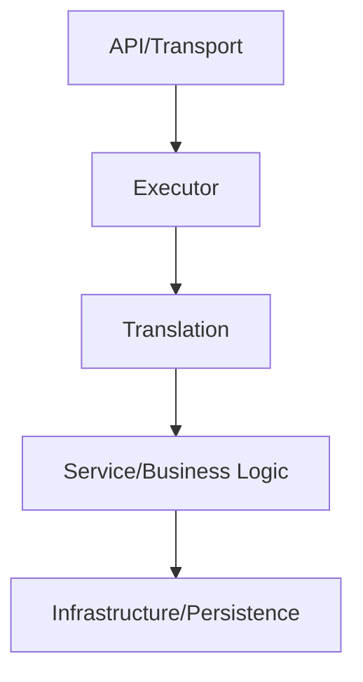

# Architecture Specification

> Generated by openlore v1.0.0 on 2026-07-24 01:29

## Purpose

This document describes the architectural patterns and structure of the system.

## Architecture Style

Layered architecture with clear separation between API handlers, business services, and
infrastructure concerns. The system uses an executor framework for provider abstraction, with
dedicated translators for cross-format request/response conversion. This layering enables
provider-agnostic routing while maintaining format-specific endpoint compatibility.

## Requirements

### Requirement: LayeredArchitecture

The system SHALL maintain separation between:
- API/Transport (HTTP routing, request parsing, and response formatting for all external-facing endpoints)
- Executor (Provider-agnostic request execution framework with streaming, retry, and failover logic)
- Translation (Cross-format request/response conversion between provider APIs (OpenAI, Claude, Gemini, Antigravity))
- Service/Business Logic (Domain-specific business operations: auth, quota, cache, optimization, health monitoring)
- Infrastructure/Persistence (Data persistence, backup/restore, logging, and system-level operations)

#### Scenario: LayerSeparation
- **GIVEN** a request from the presentation layer
- **WHEN** business logic is needed
- **THEN** the presentation layer delegates to the business layer
- **AND** direct database access from presentation is prohibited

### Requirement: SecurityModel

The system SHALL implement security via: Dual authentication system: (1) OAuth 2.0 for end-user provider connections with token refresh and singleflight deduplication, stored via CAS pattern; (2) Master admin API key for dashboard/admin API access with cryptographic randomness. Critical admin operations (password change, key regeneration, upgrade, restart, backup/restore, TLS config) are explicitly restricted from master key authentication to prevent lateral movement if the master key is compromised. Connection-scoped credential isolation.

#### Scenario: AuthenticatedAccess
- **GIVEN** an unauthenticated request
- **WHEN** accessing protected resources
- **THEN** access is denied

## System Diagram

## Layer Structure

### API/Transport

**Purpose**: HTTP routing, request parsing, and response formatting for all external-facing endpoints
**Location**: `internal/api/router.go, internal/api/handlers/v1/messages.go, internal/api/handlers/v1/embeddings.go, internal/api/handlers/v1/images.go, internal/api/handlers/v1/audio.go, internal/api/handlers/v1/unified.go, internal/api/handlers/v1/video.go, internal/api/handlers/v1/responses.go, internal/api/handlers/admin/*.go`

### Executor

**Purpose**: Provider-agnostic request execution framework with streaming, retry, and failover logic
**Location**: `internal/executor/base.go, internal/executor/openai.go, internal/executor/kiro_eventstream.go`

### Translation

**Purpose**: Cross-format request/response conversion between provider APIs (OpenAI, Claude, Gemini, Antigravity)
**Location**: `internal/translator/openai/claude/, internal/translator/openai/gemini/, internal/translator/claude/openai/, internal/translator/claude/gemini/, internal/translator/gemini/openai/, internal/translator/gemini/claude/, internal/translator/antigravity/openai/, internal/translator/antigravity/gemini/`

### Service/Business Logic

**Purpose**: Domain-specific business operations: auth, quota, cache, optimization, health monitoring
**Location**: `SystemServiceManager, ProviderSettingsManager, AuthManager, KeyManager, RequestOptimizationService, StreamTokenExtractor, BodyTokenExtractor, HealthService, ConnectionStateStore`

### Infrastructure/Persistence

**Purpose**: Data persistence, backup/restore, logging, and system-level operations
**Location**: `RestoreService, BackupHandler, LogHandler, FileUtility, ClipboardService`

## Data Flow

HTTP request → API router → format-specific handler → request validation (auth, quota, model
permissions) → optional cache lookup → executor framework → provider connection selection → request
translation to target format → upstream provider API → response translation → optional response
caching → usage tracking and logging → client response; async: health checks, quota refresh, backup
operations run via background goroutines

## External Integrations

| System | Purpose |
|--------|---------|
| OpenAI API | External integration |
| Anthropic Claude API | External integration |
| Google Gemini API | External integration |
| Grok API | External integration |
| Cloudflare Workers AI | External integration |
| Vercel Edge Network | External integration |
| Deno Deploy | External integration |
| Cloudflare Workers | External integration |
| GitHub Releases (for upgrades) | External integration |
| External DNS/IP discovery services | External integration |
| systemd (for service management) | External integration |
